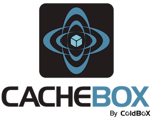

# Introduction

```
   _____           _          ____            
  / ____|         | |        |  _ \           
 | |     __ _  ___| |__   ___| |_) | _____  __
 | |    / _` |/ __| '_ \ / _ \  _ < / _ \ \/ /
 | |___| (_| | (__| | | |  __/ |_) | (_) >  < 
  \_____\__,_|\___|_| |_|\___|____/ \___/_/\_\
```

## CacheBox Manual - Version 6.x



CacheBox is a cache aggregator, in which you can aggregate different caching engines or types of the same engine into one single umbrella. It gives you built in logging (via [LogBox](http://logbox.ortusbooks.com)), an event model, synchronization, shutdown/startup procedures, reporting, interaction consoles and best of all a cache agnostic API.

**CacheBox is a standalone framework for ColdFusion (CFML) applications and it is also bundled with the ColdBox Platform.**

## Versioning

CacheBox is maintained under the [Semantic Versioning](https://semver.org) guidelines as much as possible. Releases will be numbered with the following format:

```
<major>.<minor>.<patch>
```

And constructed with the following guidelines:

* Breaking backward compatibility bumps the major (and resets the minor and patch)
* New additions without breaking backward compatibility bumps the minor (and resets the patch)
* Bug fixes and misc changes bumps the patch

## License

The ColdBox Platform, CacheBox is open source and licensed under the [Apache 2](http://www.apache.org/licenses/LICENSE-2.0.html) License.

* Copyright by Ortus Solutions, Corp
* ColdBox, CacheBox, Wirebox, LogBox are registered trademarks by Ortus Solutions, Corp

## Discussion & Help

The Box products help and discussion groups can be found here: [https://community.ortussolutions.com/](https://community.ortussolutions.com)

## Reporting a Bug

We all make mistakes from time to time :) So why not let us know about it and help us out. We also love pull requests, so please star us and fork us: [https://github.com/coldbox/coldbox-platform](https://github.com/coldbox/coldbox-platform)

### Jira Issue Tracking

* [https://ortussolutions.atlassian.net/browse/COLDBOX](https://ortussolutions.atlassian.net/browse/COLDBOX)
* [https://ortussolutions.atlassian.net/browse/WIREBOX](https://ortussolutions.atlassian.net/browse/WIREBOX)
* [https://ortussolutions.atlassian.net/browse/LOGBOX](https://ortussolutions.atlassian.net/browse/LOGBOX)
* [https://ortussolutions.atlassian.net/browse/CACHEBOX](https://ortussolutions.atlassian.net/browse/CACHEBOX)

## Professional Open Source

.png>)

ColdBox is a professional open source software backed by [Ortus Solutions, Corp](http://www.ortussolutions.com/services) offering services like:

* Custom Development
* Professional Support & Mentoring
* Training
* Server Tuning
* Security Hardening
* Code Reviews
* [Much More](http://www.ortussolutions.com/services)

## Resources

* Official Site: [http://www.coldbox.org](https://www.coldbox.org)
* CFCasts Video Training: [http://ww.cfcasts.com](http://ww.cfcasts.com)
* Source Code: [https://github.com/coldbox/coldbox-platform](https://github.com/coldbox/coldbox-platform)
* Bug Tracker: [https://ortussolutions.atlassian.net/browse/CACHEBOX](https://ortussolutions.atlassian.net/browse/CACHEBOX)
* Twitter: [@coldbox](http://www.twitter.com/coldbox)
* Facebook: [https://www.facebook.com/coldboxplatform](https://www.facebook.com/coldboxplatform)
* Vimeo Channel: [http://vimeo.com/channels/coldbox](http://vimeo.com/channels/coldbox)

### HONOR GOES TO GOD ABOVE ALL

Because of His grace, this project exists. If you don't like this, then don't read it, its not for you.

> "Therefore being justified by \*\*faith\*\*, we have peace with God through our Lord Jesus Christ: By whom also we have access by \*\*faith\*\* into this \*\*grace\*\* wherein we stand, and rejoice in hope of the glory of God." Romans 5:5
