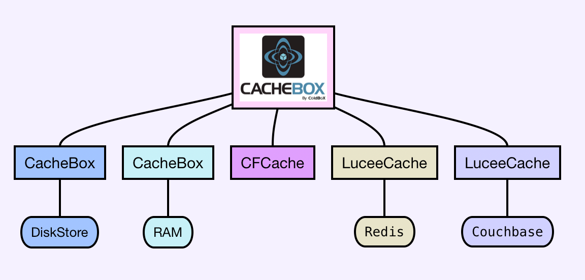

# Overview

## Features at a Glance

* **Cache Aggregator**
  * Ability to aggregate different caching engines
  * Ability to aggregate different configurations of the same caches
  * Rich aggregation event model
  * Granular logging
* **Fast and Simple to use**
  * Fast ColdFusion and Java hybrid cache
  * Simple API and configuration parameters
  * Small Footprint
  * There is no need to create it, configure it, or manage it if used within a ColdBox Application.
* **Solid Core**
  * Multi-Threaded
  * Based on [Java Concurrency Classes](http://docs.oracle.com/javase/tutorial/essential/concurrency/)
  * Multiple [Eviction Policies](http://en.wikipedia.org/wiki/Cache\_algorithms): LRU, LFU and FIFO
  * Memory Management & Memory Sensitive Caching based on [Java Soft References](http://docs.oracle.com/javase/7/docs/api/java/lang/ref/SoftReference.html)
  * High Load Tested
  * Fully Documented
* **Extensible & Flexible**
  * Cache Listeners for event broadcasting
  * Create custom eviction policies
  * Create cache providers
  * Create your own CacheBox object storage
  * Extensive and granular purging mechanisms (regular expressions and key snippets)
* **Highly Configurable**
  * JVM Threshold Checks
  * Object Limits
  * Ability to time expire objects
  * Eternal (singletons) and time-lived objects
  * Object purging based on object usage (Access Timeouts)
  * Fully configurable at runtime via dynamic configurations and hot-updates
* **Visually Appealing and Useful**
  * Fully featured caching monitor and commands panel
  * Complete cache performance reports

## Cache Aggregator

CacheBox is a cache aggregator in which you can aggregate different caching engines or types of the same engine into one umbrella. It gives you built-in logging (via [LogBox](http://logbox.ortusbooks.com)), an event model, synchronization, shutdown/startup procedures, reporting, interaction consoles, and a cache-agnostic API.

<figure><figcaption>
CacheBox Aggregation of Caches
</figcaption></figure>

CacheBox allows you to manage and create custom, what we call [Cache Providers](../usage/cache-providers/), that talk to different caching engines that you would like to configure in your applications. By aggregating them within CacheBox, you benefit from a rich event model for all caches to share, report, and debug.

## Caching API

These cache providers also share the same interaction API and thus give you an excellent level of abstraction, higher extensibility, and flexibility when planning your applications or trying to scale them out.

<figure><figcaption>
CacheBox API Providers
</figcaption></figure>

You can build your applications based on this abstract API and then be able to configure the caches for your applications at runtime. This gives you greater flexibility and scalability when planning and writing your applications, as they can be targeted for ANY CFML engine or version.

## Enterprise Caching Engine

Caching has been a central concern in the ColdBox Platform since its first version. We have always been concerned with mission-critical applications, scalability, and the ability to provide granular caching aspects to ColdFusion (CFML) applications within a single in-process caching engine with different storage capabilities that could be in-process or distributed.

<figure><figcaption>
CacheBox Engine Architecture
</figcaption></figure>

Foremost, CacheBox behaves as an in-memory cache designed for objects, data, HTML fragments, or anything else you like. It has various tuning parameters such as default object timeout, default last access timeout, maximum objects in the cache, a JVM memory threshold, a reaping frequency, eviction policies, an event model, and so much more.

We also use object stores for the CacheBox caching engine. This means that CacheBox can be configured to store its cached objects in different locations other than memory. This gives us great flexibility because we offer a wide gamut of storage options, plus the concept of actually building your storage.

### Cache Debugger & Reporter

.jpg>)

We have an excellent cache debugger where you can visualize all your configured caches from within your application. You can see the performance of the cache the contents, and even issue commands to the targeted cache provider.

### Useful Resources

* [CacheBox Release Notes](https://ortussolutions.atlassian.net/browse/CACHEBOX)
* [http://en.wikipedia.org/wiki/Cache](http://en.wikipedia.org/wiki/Cache)
* [http://ehcache.org/documentation/getting\_started.html](http://ehcache.org/documentation/getting\_started.html)
* [http://www.oracle.com/technetwork/middleware/coherence](http://www.oracle.com/technetwork/middleware/coherence)
* [http://www.couch.io/](http://www.couch.io/)
* [http://ecet.ecs.ru.acad.bg/cst05/Docs/cp/SII/II.20.pdf](http://ecet.ecs.ru.acad.bg/cst05/Docs/cp/SII/II.20.pdf)
* [http://www.ibm.com/developerworks/java/library/j-jtp01246.html](http://www.ibm.com/developerworks/java/library/j-jtp01246.html)
* [http://java.sun.com/j2se/1.5.0/docs/api/java/lang/ref/SoftReference.html](http://java.sun.com/j2se/1.5.0/docs/api/java/lang/ref/SoftReference.html)
* [http://jdj.sys-con.com/read/36434\_p.htm](http://jdj.sys-con.com/read/36434\_p.htm)
