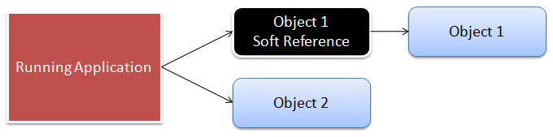

# ConcurrentSoftReferenceStore

The `ConcurrentSoftReferenceStore` uses a combination of concurrency maps and java soft references. In our introductory sections we introduced java soft references and how it allows us to create placeholders in memory for objects and when the JVM needs memory it has permission to collect these placeholders and thus release memory. This is truly a great combination to have and ColdBox leverages this for its template, event and view fragment caching.

Just remember that when you use this object storage, the time spans are never guaranteed as the JVM has permission to cleanup objects when it sees fit. To get much better performance on the JVM memory heap space and a more active memory, we recommend using this object storage. Research has also indicated that a combination of memory sensitive structures in combination with limits in a cache, can increase performance and optimize its usage. So please make sure limits are set in the cache.

## Properties

* _None_

You can also find some great research out there about concurrency maps and soft references:

* [http://www.ibm.com/developerworks/java/library/j-jtp07233.html](http://www.ibm.com/developerworks/java/library/j-jtp07233.html)
* [http://www.ibm.com/developerworks/java/library/j-jtp01246.html](http://www.ibm.com/developerworks/java/library/j-jtp01246.html)

